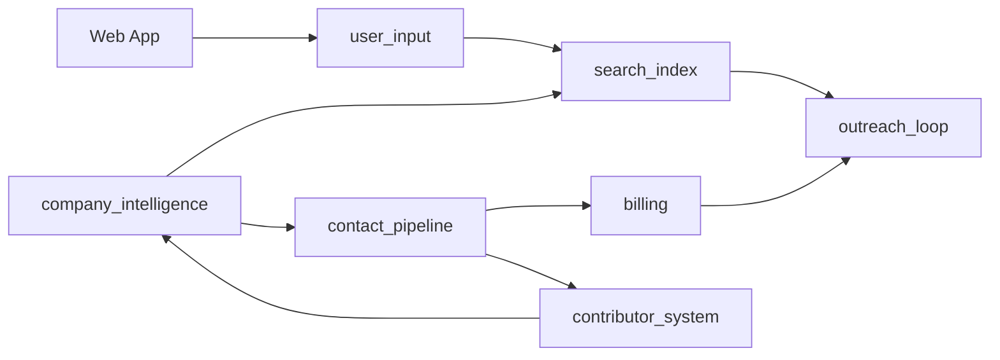

# Active Context Map (Modular Monolith)

This context map defines module boundaries, ownership, and interaction contracts for Active.

## Bounded Contexts

1. `user_input`: captures and normalizes user intent (market, regions, personas, seniority, signals).
2. `company_intelligence`: ingests company data and computes signal intelligence.
3. `contact_pipeline`: manages contact stubs and unlock-time enrichment waterfall.
4. `search_index`: syncs/query-optimizes denormalized records for fast UX search.
5. `contributor_system`: tracks corrections, verification tasks, and credit rewards.
6. `billing`: plan management, credit ledger, and payment integration.
7. `outreach_loop`: lists, export, and downstream activation workflows.

## Relationship Map

## Module Contracts

### `user_input` -> `search_index`
- Contract: normalized search spec.
- Why: keeps UI variability out of indexing and query execution.

### `company_intelligence` -> `search_index`
- Contract: denormalized company intelligence payload.
- Why: search should consume flattened documents, not raw ingestion internals.

### `company_intelligence` -> `contact_pipeline`
- Contract: company candidates with relevance/signal context.
- Why: contact stub and enrichment should only run for worthwhile company targets.

### `contact_pipeline` -> `billing`
- Contract: unlock request and credit deduction events.
- Why: payment and credit ledger stays authoritative in one module.

### `contact_pipeline` -> `contributor_system`
- Contract: data quality outcomes (bounce, invalid, stale).
- Why: contributor rewards should react to verified quality signals.

### `search_index` -> `outreach_loop`
- Contract: ranked company/contact selections for list/export/activation.
- Why: outreach consumes curated results, not raw records.

### `contributor_system` -> `company_intelligence`
- Contract: validated correction events.
- Why: corrected data should feed back into intelligence and scores.

## Import Discipline

1. Cross-module imports go through `src/modules/<module>/api`.
2. No direct imports into another module's `domain/`, `application/`, or `infrastructure/`.
3. Shared concerns go to `src/shared` only if generic and reusable.

## Public Repo Notes

1. Keep architecture docs synchronized with code structure.
2. Keep `data/raw`, `data/processed`, and `data/sessions` out of git.
3. Use example payloads in docs, never real tokens or private datasets.
