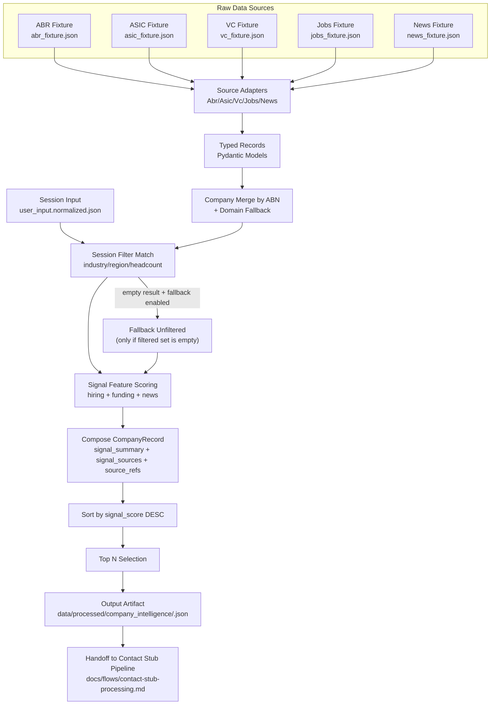

# Company Intelligence Processing Flow

This document describes how Active processes company raw data into ranked company outputs for a session.

## Scope

- Input: session-normalized user input + raw company source datasets
- Output: ranked `CompanyRecord` list in `data/processed/company_intelligence/<run_id>.json`

## Mermaid Flow



## Processing Stages

1. Load session input
- Reads normalized session payload from:
  - `data/sessions/<session_id>/user_input.normalized.json`

2. Load raw source records
- Uses source adapters under:
  - `src/modules/company_intelligence/infrastructure/sources/`

3. Build merged company candidates
- Primary join key: `abn`
- Secondary helper: `domain` (for provenance consistency)

4. Apply session filters
- Uses user input firmographics (industry, regions, headcount)
- If result is empty and `--fallback-unfiltered` is enabled, re-runs without filters

5. Score signals
- `hiring_score` from jobs data
- `funding_score` from VC/funding recency
- `news_score` from recent mentions
- Composite score (MVP):
  - `signal_score = hiring*0.6 + funding*0.3 + news*0.1`

6. Build contract payload
- Produces `CompanyRecord` fields:
  - `company_id`, `name`, `domain`, `location`, `industry`, `headcount_range`
  - `signal_score`, `signal_summary`, `signal_sources`, `source_refs`, `updated_at_utc`

7. Sort and persist
- Sort by `signal_score` descending
- Keep top N
- Save output JSON with metadata

8. Handoff to contact pipeline
- Company output artifact is the upstream input for contact stub creation:
  - `docs/flows/contact-stub-processing.md`

## Current Run Commands

1. Validate adapters:
```powershell
$env:PYTHONPATH='.'
.\.venv\Scripts\python.exe scripts/test_company_sources.py
```

2. Build ranked output:
```powershell
$env:PYTHONPATH='.'
.\.venv\Scripts\python.exe scripts/run_company_intelligence_ranking.py --input-file data/sessions/<session_id>/user_input.normalized.json --top 10 --fallback-unfiltered
```

## Output Example

- `data/processed/company_intelligence/20260218T113506Z.json`
- Key metadata fields:
  - `run_id`
  - `input_file`
  - `fallback_unfiltered_used`
  - `count`
  - `records[]`
