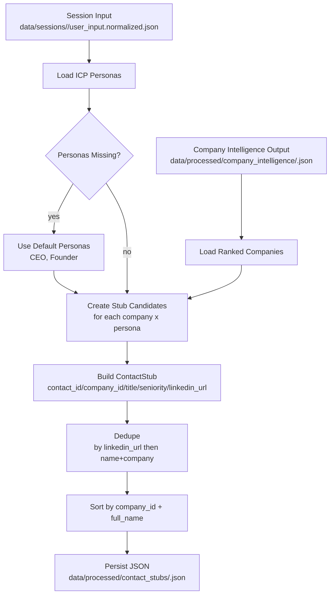

# Contact Stub Processing Flow

This document describes how Active creates contact stubs from ranked companies for a session.

## Scope

- Input: ranked company intelligence output + session normalized personas
- Output: contact stubs in `data/processed/contact_stubs/<run_id>.json`

## Mermaid Flow



## Processing Stages

1. Read ranked companies
- Loads `records[]` from a company intelligence run artifact.

2. Read user personas
- Reads `normalized.icp.personas[]` from session input.
- If missing, defaults to:
  - `CEO`
  - `Founder`

3. Generate contact stubs
- For each selected company and persona slot:
  - Generate deterministic fake name
  - Assign title from persona
  - Infer `seniority` from title keyword rules
  - Generate deterministic LinkedIn URL-like slug
  - Mark `is_stub_only=true`, `stub_source=google_search`

4. Deduplicate and sort
- First key: `linkedin_url`
- Fallback key: `full_name + company_id`
- Final sort: `company_id`, `full_name`

5. Persist output artifact
- Writes metadata plus `records[]` to:
  - `data/processed/contact_stubs/<run_id>.json`

## Run Command

```powershell
$env:PYTHONPATH='.'
.\.venv\Scripts\python.exe scripts/run_contact_stub_pipeline.py --company-run-file data/processed/company_intelligence/<run_id>.json --top-companies 10 --stubs-per-company 2
```

If `--session-input-file` is not passed, the script uses `input_file` inside the company run file.
