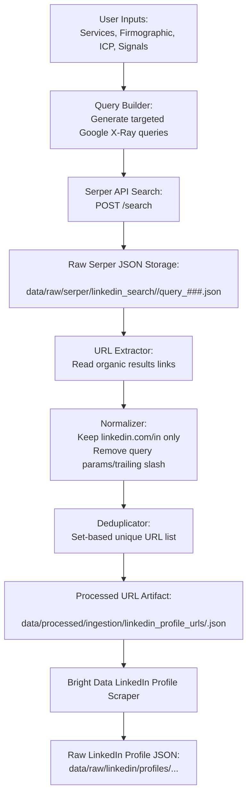

# Ingestion Flow: User Inputs -> Serper -> LinkedIn Profile URLs

This document defines the low-level ingestion flow for collecting LinkedIn profile candidates from Serper and preserving raw API payloads.

## Scope

- Start: user-defined market inputs (services, firmographic, ICP, signals)
- End: normalized, deduplicated LinkedIn profile URLs ready for Bright Data profile scraping
- Rule: save raw Serper responses as immutable JSON artifacts

## Mermaid Flow



## Data Artifacts

### 1) Raw Serper response (immutable)

Path pattern:
- `data/raw/serper/linkedin_search/<run_id>/query_001.json`
- `data/raw/serper/linkedin_search/<run_id>/query_002.json`
- `data/raw/serper/linkedin_search/<run_id>/manifest.json`

Example shape:

```json
{
  "meta": {
    "run_id": "2026-02-16T10-30-00Z",
    "query_id": "query_001",
    "query": "site:linkedin.com/in (\"VP Engineering\" OR CTO) ...",
    "source": "serper",
    "collected_at_utc": "2026-02-16T10:30:12Z"
  },
  "response": {
    "organic": []
  }
}
```

### 2) Processed LinkedIn URL output

Path pattern:
- `data/processed/ingestion/linkedin_profile_urls/<run_id>.json`
- optional: `data/processed/ingestion/linkedin_profile_urls/<run_id>.csv`

Example shape:

```json
{
  "run_id": "2026-02-16T10-30-00Z",
  "target_count": 100,
  "unique_count": 100,
  "urls": [
    "https://www.linkedin.com/in/example-one",
    "https://www.linkedin.com/in/example-two"
  ]
}
```

## Operational Rules

1. Raw Serper payloads are append-only; do not overwrite existing run folders.
2. URL extraction only accepts profile URLs under `linkedin.com/in/`.
3. Normalization runs before deduplication.
4. Bright Data scraping consumes processed URL artifacts, not raw Serper JSON directly.
