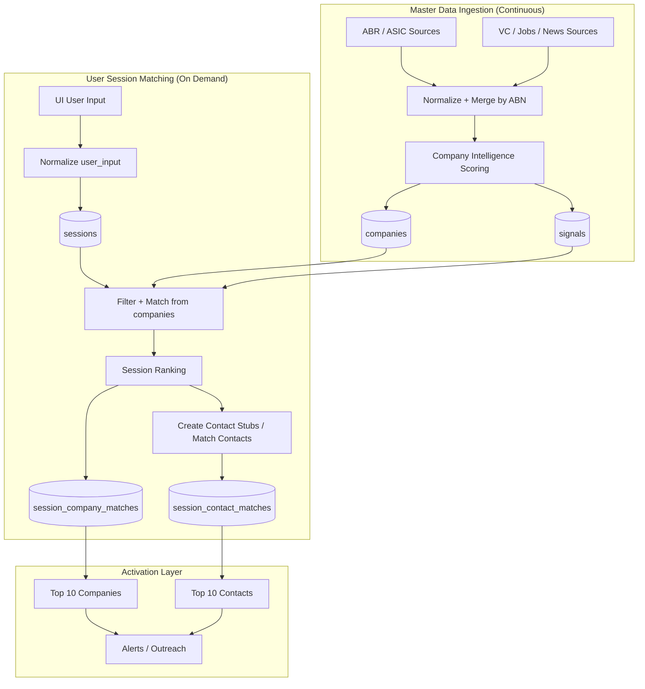

# Master Data + Session Matching (High-Level)

This view separates:
- long-lived **master data** (ABN/government-centered truth), and
- per-run **session matching** (user-specific top companies/contacts).

## Why this shape works

1. `companies` and `signals` stay as canonical truth keyed by ABN.
2. Each user run creates its own `sessions` + match tables without corrupting master data.
3. You can re-rank quickly from existing master records instead of re-ingesting everything each session.
4. The UI can show personalized results while keeping provenance and audit trail.
