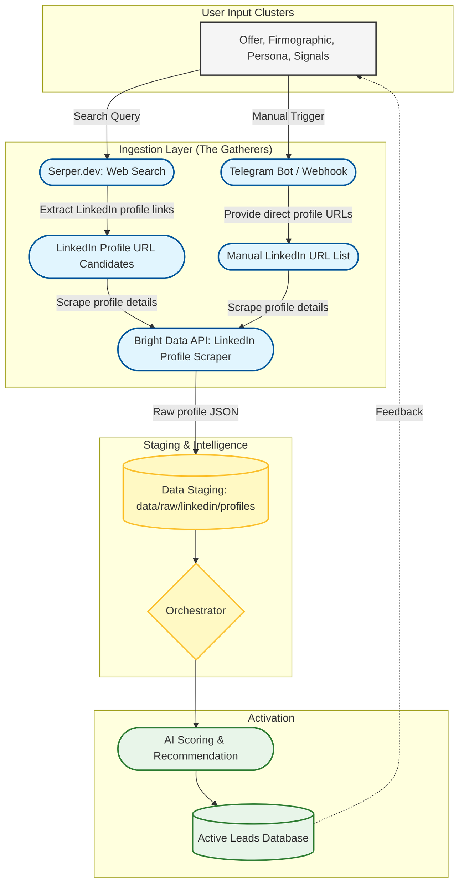

# Active System Architecture

```mermaid
graph TD
    %% 1. Input Layer
    subgraph User_Input ["User Input Clusters"]
        A[Offer, Firmographic, Persona, Signals]
    end

    %% 2. Ingestion Layer
    subgraph Ingestion ["Ingestion Layer (The Gatherers)"]
        A -->|Search Query| B1([Serper.dev: Web Search])
        B1 -->|Extract LinkedIn profile links| B1a([LinkedIn Profile URL Candidates])
        B1a -->|Scrape profile details| B2([Bright Data API: LinkedIn Profile Scraper])

        A -->|Manual Trigger| B3([Telegram Bot / Webhook])
        B3 -->|Provide direct profile URLs| B4([Manual LinkedIn URL List])
        B4 -->|Scrape profile details| B2
    end

    %% 3. Intelligence & Brain
    subgraph Intelligence ["Staging & Intelligence"]
        B2 -->|Raw profile JSON| C[(Data Staging: data/raw/linkedin/profiles)]
        C --> D{Orchestrator}
    end

    %% 4. Activation Layer
    subgraph Activation ["Activation"]
        D --> E([AI Scoring & Recommendation])
        E --> F[(Active Leads Database)]
    end

    %% Feedback Loop
    F -.->|Feedback| A

    %% --- STYLING ---
    classDef input fill:#f5f5f5,stroke:#333,stroke-width:2px;
    classDef ingest fill:#e1f5fe,stroke:#01579b,stroke-width:2px;
    classDef brain fill:#fff9c4,stroke:#fbc02d,stroke-width:2px;
    classDef active fill:#e8f5e9,stroke:#2e7d32,stroke-width:2px;

    class A input;
    class B1,B1a,B2,B3,B4 ingest;
    class C,D brain;
    class E,F active;
```
